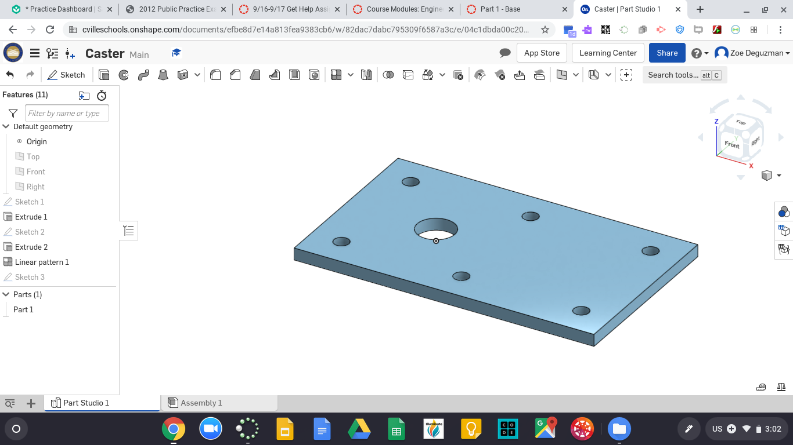
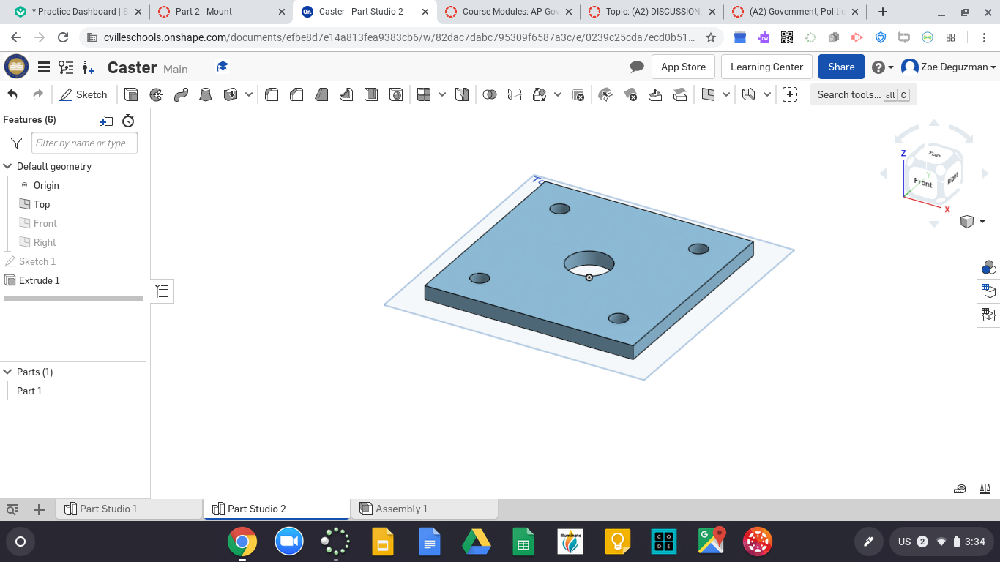
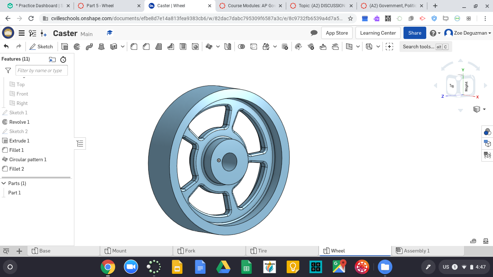
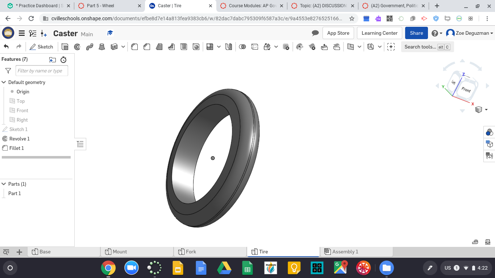
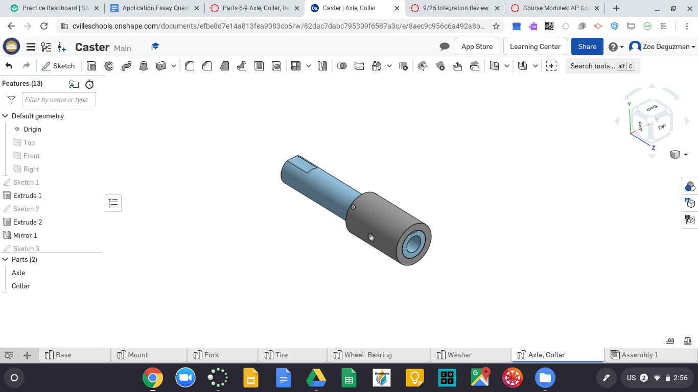
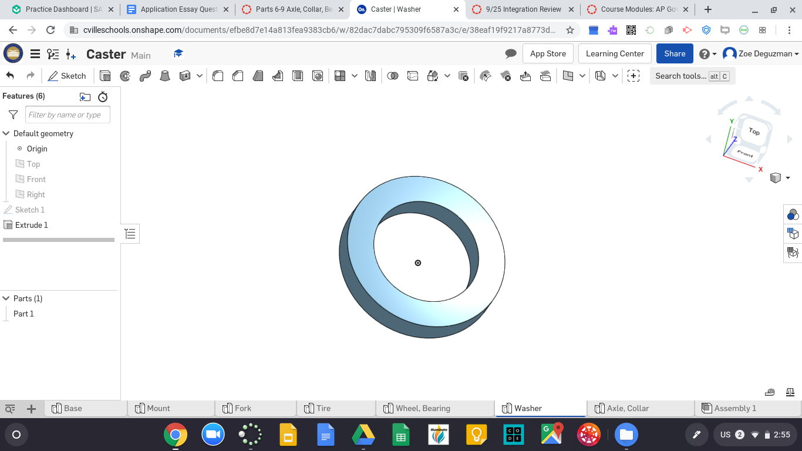
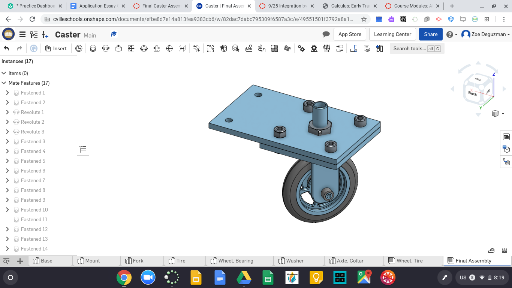

# Caster
### [link to caster onshape document!](https://cvilleschools.onshape.com/documents/efbe8d7e14a813fea9383cb6/w/82dac7dabc795309f6587a3c/e/49551501f3792a8a1a6f5e5d)

- **Base**

- **Mount**

- **Fork**

- **Wheel**

- **Tire**

- **Axle & Collar**

- **Bearing**

- **Washer**

- **Final Assembly**

