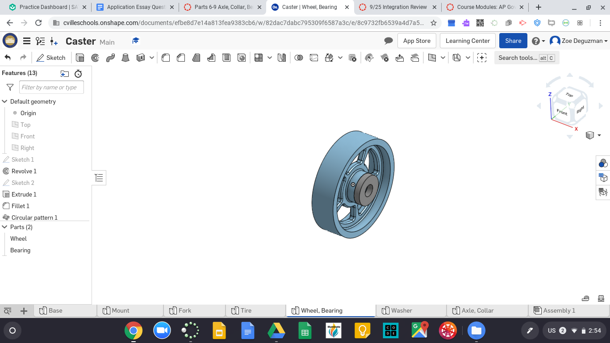
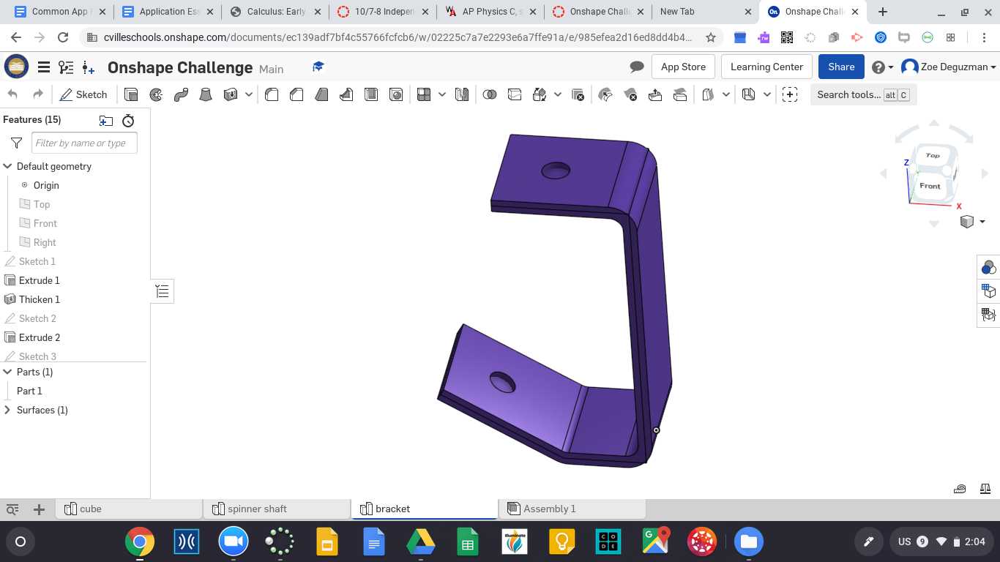

# Onshape Assignments
### [link to caster onshape document!](https://cvilleschools.onshape.com/documents/efbe8d7e14a813fea9383cb6/w/82dac7dabc795309f6587a3c/e/49551501f3792a8a1a6f5e5d)

- **Base**

- **Mount**

- **Fork**

- **Wheel**

- **Tire**

- **Axle & Collar**

- **Bearing**

- **Washer**

- **Final Assembly**

### [link to dorothy's dowel pins onshape document!](https://cvilleschools.onshape.com/documents/21581d0deec776e4ff3f4d38/w/358d316a9c78fbe9507db262/e/97710db6f1c417874538c0c3)

- **Dowel Pin**

This part has four diameter configurations (1/4 inch, 3/8 inch, 1/2 inch, 5/8 inch) and four length configurations (.5 inch, 1 inch, 1.5 inch, 2 inch), making 16 total possible configurations.

- **Frame Side**

This has two configurations of the outside length: 12 inch and 9 inch.

- **Frame with Dowels**

WOW! Mates are so much easier in Onshape, just 3 fasten mates and 8 revolute mates and you're done!

### [link to onshape challenge!](https://cvilleschools.onshape.com/documents/ec139adf7bf4c55766fcfcb6/w/02225c7a7e2293e6a7ffe91a/e/0765c6eabe6468150358734c)

- **Cube**

- **Spinner Shaft**

- **Bracket**

- **Final Assembly**

Important: use revolute mates to connect the cube to the spinner shaft... but use cylindrical mates to connect the spinners to the bracket.

